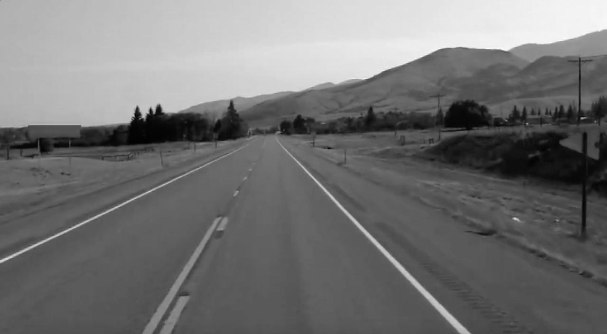
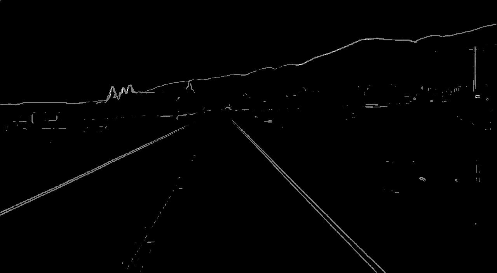
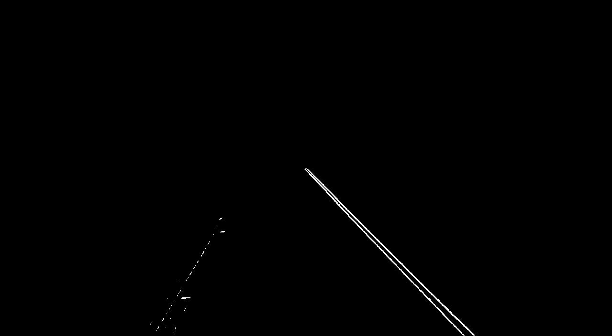
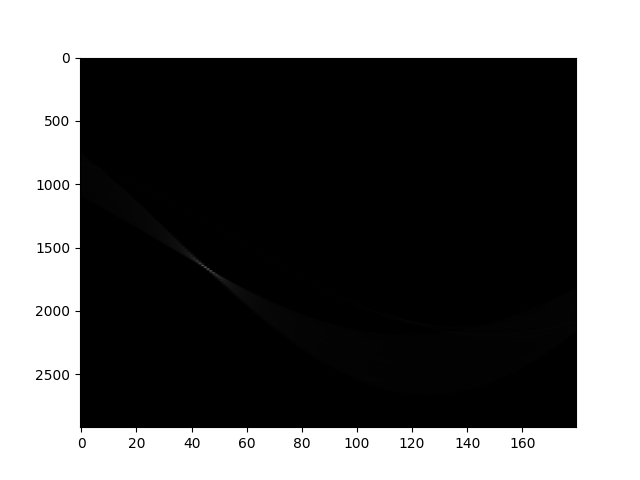
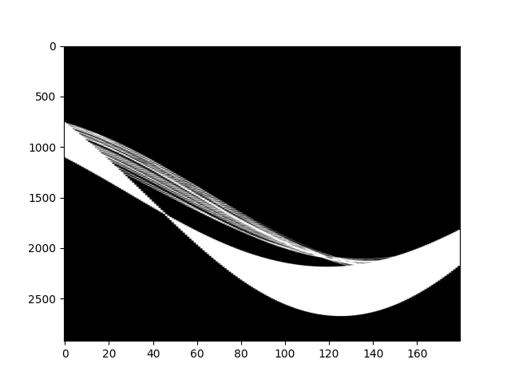
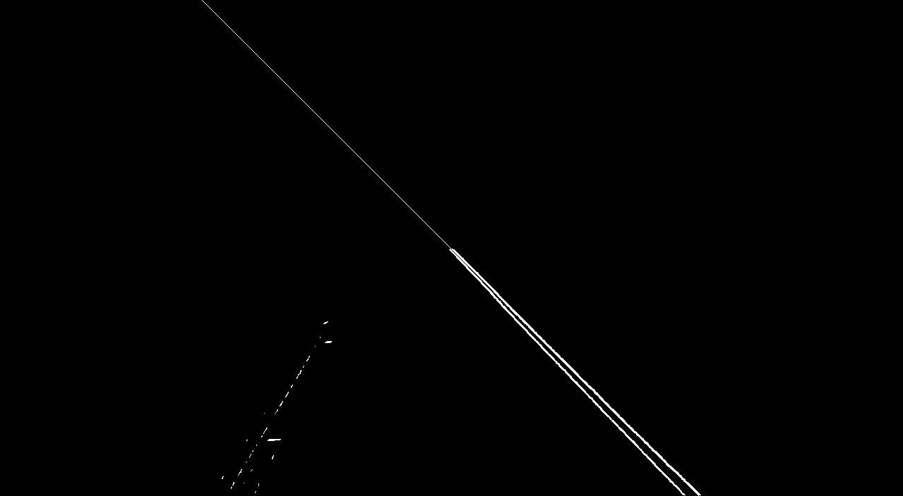
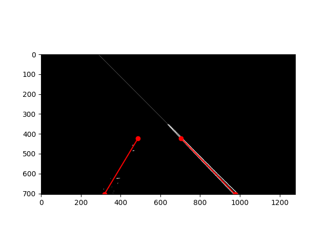
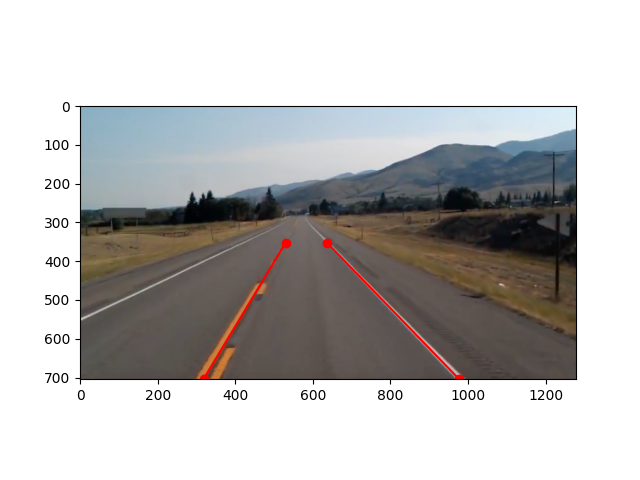

# Lane Detection

## Black and White
Convert RGB image to black and white image\
\


## Edge Detector
Takes a single channel image and apply a kernel.
Using a first order derivative to find edges in an image.\


## Region of Interest
Masks out uncessary data\


## Equations
Basic equations
```bash
cos(theta) = x/r
sin(theta) = y/r
x^2 + y^2 = r^2
```
Convert cartesian coordinates x and y into polar coordinates r and theta
```bash
r^2 = x(rcos(theta)) + y(rsin(theta))
r = xcos(theta) + ysin(theta)
```
Convert polar coordinates back into cartesian coordinates
```bash
x(rcos(theta)) + y(rsin(theta)) = r^2
xcos(theta) + ysin(theta) = r
y = -xcos(theta)/sin(theta) + r/sin(theta)
y = mx + b
```

## Hough Transform
Transforms x, y space into rho, theta space to represent lines. Each point in x, y coordinates is a line in rho, theta coordinates. Each point in rho, theta coordinates is a line in x, y coordinates. Hough transform takes all points of the lines in x, y cordinates and tries out all possible combinations in rho, theta coordinates. The intersecting lines are votes for the most correct rho, theta coordinates. Using m, b in x, y space cannot represent vertical lines due to m being infinite.\
\
Boosted values to see what the accumulator looks like\


## Inverse Hough Transform
The rho, theta with the most votes are the largest lines in x, y coordinates. With each rho, theta pair, can draw lines back in x, y space.\


## Left and Right lanes
With the accumulator, can take out rho, theta pairs and find the slope of the line. If it has negative slope, it is the left lane; if it has a positive slope, it is the right lane. Find all the slope, y intercept pairs and averaging them to find the main left and right lane.\


## Plot
Plot slope, y intercept of left and right lane back onto original image.\

